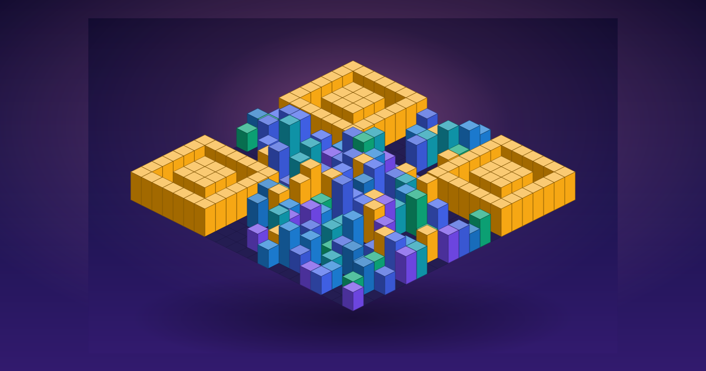

<div align="center">



# Building QR

**링크를 스캔 가능한 3D 빌딩숲(도시 스카이라인) QR 아트로 만들어주는 생성기**

*Turn any link into a scannable QR code that stands up as an isometric city skyline.*

[](https://building-qr.vercel.app)
[](#-로드맵)
[](LICENSE)
[](https://react.dev)
[](https://www.typescriptlang.org)
[](https://threejs.org)
[](https://vite.dev)

[**▶ 웹앱 (라이브)**](https://building-qr.vercel.app) · [랜딩 페이지](https://jeiel85.github.io/building-qr/) · [기능](#-기능) · [동작 방식](#-동작-방식) · [로드맵](#-로드맵) · [설계 문서](docs/design/)

> ⚠️ 개발 중입니다. 현재 라이브에서 **링크 입력 → 3D 빌딩숲 ↔ 2D 평면 전환 · 스타일 프리셋 3종 · 고해상도 PNG 저장/공유(컬러·흑백·투명·1024~4096)**까지 동작합니다. 다음은 Android 앱 패키징(Phase 9)입니다.

</div>

---

## 개요

일반 QR 코드는 기능적이지만 예쁘지 않습니다. **Building QR**은 QR을 단순 정보 전달 수단이 아니라
**공유 가능한 시각 콘텐츠**로 만듭니다.

QR 매트릭스의 **어두운 모듈은 빌딩으로 솟고**, **밝은 모듈은 거리**가 됩니다. 위에서 내려다보면
여전히 QR이고, 비스듬히 보면 한 채 한 채 다른 도시의 스카이라인입니다. 세 모서리의 finder pattern은
랜드마크 빌딩 클러스터로 표현됩니다.

> 핵심 원칙: **예뻐도 스캔되지 않으면 실패다.** 3D 아트는 감상용, 2D 스캔 모드는 인식 보장용으로
> 분리해 “예쁨”과 “스캔 신뢰성”을 모두 잡습니다.

## ✨ 기능

- 🏙️ **3D 빌딩숲 아트** — QR 매트릭스를 아이소메트릭 도시로 렌더링 (Three.js · InstancedMesh)
- 📷 **스캔 보장 2D 모드** — 탑다운 고대비 보기로 finder pattern·quiet zone을 지켜 실제 카메라로 인식
- 🔁 **3D ↔ 2D 전환** — 부드러운 카메라 전환, `prefers-reduced-motion` 대응
- 🔒 **서버 없는 로컬 생성** — 입력 링크를 외부로 전송하지 않음, 계정·추적 SDK 없음
- 🎨 **스타일 / 색상 프리셋** — 도시 팔레트와 분위기를 선택, 같은 입력은 항상 같은 도시로 재현
- 🖼️ **고해상도 PNG 내보내기 · 모바일 공유** — 명함·초대장·포스터·스티커용
- 📶 **오프라인 동작 · 저사양 fallback** — WebGL 미지원 시 2D 미리보기로 안전하게 전환

## 🧭 동작 방식

```text
링크 입력 → 입력 검증 → QR 매트릭스 생성 → 스캔 신뢰성 점수
        → 아트 매핑(블록 데이터) → Three.js 렌더 → 3D 감상 / 2D 스캔
        → PNG 내보내기 · 공유 · 로컬 저장
```

1. **링크 입력** — 프로필·블로그·초대장·메뉴판 등 URL이나 짧은 텍스트를 넣습니다.
2. **QR 생성 & 검증** — QR 매트릭스를 만들고 스캔 신뢰성을 점수로 보여줍니다. 너무 길면 경고합니다.
3. **도시로 세우기** — 3D 빌딩숲으로 감상하고, 스캔 모드로 전환해 저장·공유합니다.

## 🛠 기술 스택

| 영역 | 선택 |
|---|---|
| UI | React + TypeScript (strict) |
| Build | Vite |
| 3D 렌더링 | Three.js (WebGL) · InstancedMesh |
| QR 생성 | qrcode |
| 상태 | Zustand |
| 테스트 | Vitest (unit) · Playwright (E2E) |
| 모바일 패키징 | Capacitor (Android, 이후 iOS) |
| 웹 배포 | Vercel |
| 품질 | ESLint · Prettier · GitHub Actions |

> WebGPU 대신 WebGL/Three.js를 1차 표준으로 둡니다 — 브라우저/모바일 WebView 호환성과 운영 안정성 우선.

## 📁 프로젝트 구조 (계획)

```text
src/
├─ app/                    # App, routes, providers
├─ features/building-qr/
│  ├─ components/          # 화면·패널 UI
│  ├─ qr/                  # QR 매트릭스 생성·검증·스캔 휴리스틱 (순수 함수)
│  ├─ art/                 # 매트릭스 → 빌딩 블록 데이터 (deterministic)
│  ├─ render/              # Three.js scene·instancing·camera·lighting
│  └─ store/               # Zustand 상태
├─ shared/                 # 공용 컴포넌트·유틸·타입
├─ platform/               # capacitor / web / share 어댑터
└─ tests/                  # unit · e2e · fixtures
docs/
├─ index.html              # GitHub Pages 랜딩
├─ assets/                 # 히어로 이미지 등
└─ design/                 # 제품·아키텍처 설계 문서 묶음
```

## 🚀 시작하기

> Phase 1(프로젝트 기반)이 올라가 아래 스크립트가 모두 동작합니다. `npm install` 후 `npm run dev`.

```bash
npm install      # 의존성 설치
npm run dev      # 개발 서버
npm run build    # 프로덕션 빌드
npm run preview  # 빌드 미리보기
npm run test     # 유닛 테스트 (Vitest)
npm run test:e2e # E2E 테스트 (Playwright)
npm run lint     # ESLint
npm run typecheck# 타입 검사
```

히어로 이미지를 다시 만들려면:

```bash
node tools/gen-hero.mjs   # docs/assets/hero.svg 재생성
```

## 🗺 로드맵

설계는 MVP가 아니라 **스토어 배포 가능한 완성도**를 목표로 합니다. 개발은 다음 순서로 진행합니다.

- [x] **Phase 1** — 프로젝트 기반 (Vite·TS strict·구조·CI 스크립트) ✅
- [x] **Phase 2** — QR 매트릭스 엔진 & 입력 검증 ✅
- [x] **Phase 3** — 스캔 가능한 2D 미리보기 ✅
- [x] **Phase 4** — 3D 빌딩 블록 데이터 생성기 ✅
- [x] **Phase 5** — Three.js 3D 렌더러 ✅
- [x] **Phase 6** — 3D ↔ 2D 모드 전환 ✅
- [x] **Phase 7** — 내보내기 · 공유 · 저장 ✅
- [x] **Phase 8** — 제품 UI/UX 다듬기 ✅
- [ ] **Phase 9** — Capacitor Android 패키징
- [ ] **Phase 10** — 릴리즈 하드닝 & 스토어 제출

자세한 단계별 설계는 [`docs/design/`](docs/design/)에 있습니다.

## 🔐 개인정보

- 계정·로그인 없음, 서버 저장 없음
- 입력한 링크/텍스트를 외부로 전송하지 않음 — QR 생성은 전적으로 기기에서 로컬 수행
- 광고 SDK·분석 SDK 없음

## 📄 라이선스 & 크레딧

- 본 저장소 코드는 **MIT 라이선스** 오픈소스입니다. 자유롭게 사용·수정·배포할 수 있습니다.
  전문은 [`LICENSE`](LICENSE)를 확인하세요.
- 사용 중인 오픈소스 의존성(React, Vite, Three.js, qrcode, Zustand, Capacitor, Vitest, Playwright 등)은
  각자의 라이선스를 따릅니다. 출시 전 오픈소스 고지 화면을 별도로 준비합니다.
- 본 프로젝트는 cherry-blossom QR 데모의 **아이디어/UX에서 영감**을 받았습니다. 다만 원본 코드·shader·
  상수를 복사하지 않고 **빌딩숲 컨셉으로 독자 재구현**합니다.

---

<div align="center">
<sub>© 2026 Building QR · Made with QR + 도시 + 빛</sub>
</div>
